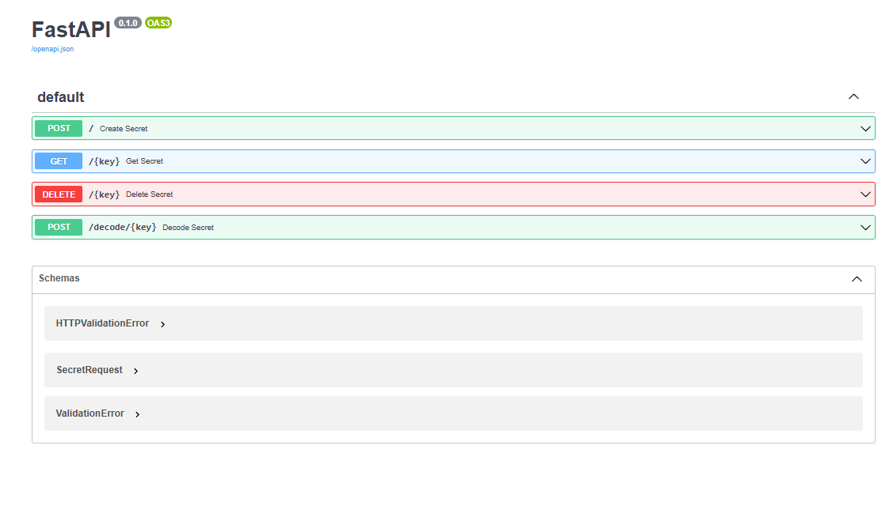
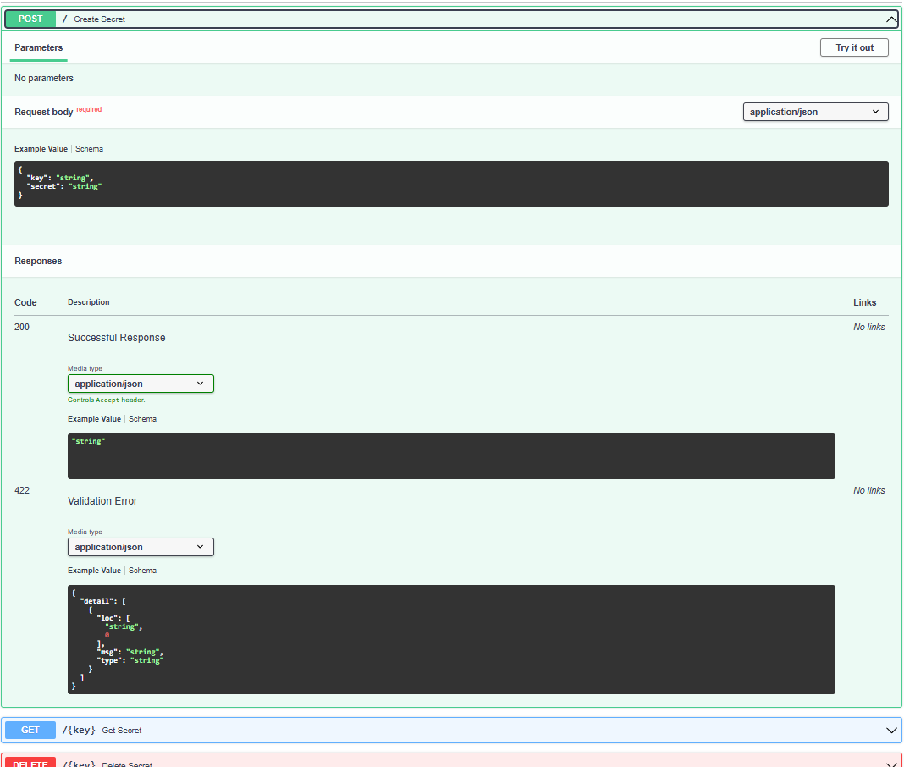

# Одноразовые секреты

## Описание проекта

Сервис "Одноразовые секреты" — это HTTP-сервис, разработанный на основе **FastAPI**, который позволяет хранить конфиденциальные данные (секреты) с возможностью их однократного получения. После первого запроса к секрету он становится недоступным, что обеспечивает высокий уровень безопасности.

## Функциональные возможности

- **Создание секрета**: Пользователь может создать секрет, который будет храниться в зашифрованном виде.
- **Получение секрета**: Секрет может быть получен только один раз. После первого запроса он становится недоступным.
- **Удаление секрета**: Секрет может быть удален по запросу пользователя, если передана фраза-пароль.
- **Кеширование**: Секреты кешируются на сервере в течение 5 минут после создания.
- **Логирование**: Все действия с секретами (создание, получение, удаление) логируются в базе данных **PostgreSQL**.

## Технологический стек

- **Язык**: Python 3.x
- **Web-фреймворк**: FastAPI
- **База данных**: PostgreSQL
- **ORM**: SQLAlchemy
- **Кеширование**: Redis
- **Контейнеризация**: Docker (Dockerfile / docker-compose)

## Установка и запуск

### Предварительные требования

- Установленный [Docker](https://www.docker.com/get-started) и [Docker Compose](https://docs.docker.com/compose/install/).
- Установленный [Poetry](https://python-poetry.org/docs/#installation) для управления зависимостями.

### Шаги для установки зависимостей

1. Клонируйте репозиторий:

   ```bash
   git clone <https://github.com/MikaTarro/SecretData_v1.git>
   cd SecretsData_app

### Установите зависимости с помощью Poetry:

    poetry install

### Настройте переменные окружения в файле docker-compose.yml:
    <>yaml
    environment:
    - DATABASE_URL=postgresql://username:password@db/dbname  # Замените на свои данные

### Запустите сервис с помощью Docker Compose:
1.
   ```bash
    docker-compose up --build
    Сервис будет доступен по адресу: http://localhost:8000

## API
- **Документация API** http://localhost:8000/docs


### 1. Создание секрета

- **Метод**: `POST`
- **URL**: `/secrets/`
- **Описание**: Создает новый секрет и возвращает уникальный идентификатор.
- **Тело запроса** (JSON):

### 2. Получение секрета
- **Метод**: `GET`
- **URL**: `/secrets/{secret_key}`
- **Описание**: Возвращает секрет по уникальному ключу. Секрет становится недоступным после первого запроса.
- 
### 3. Удаление секрета
- **Метод**: `DELETE`
- **URL**: `/secrets/{secret_key}`
- **Описание**: Удаляет секрет по уникальному ключу. Может потребоваться фраза-пароль.
- 
- 